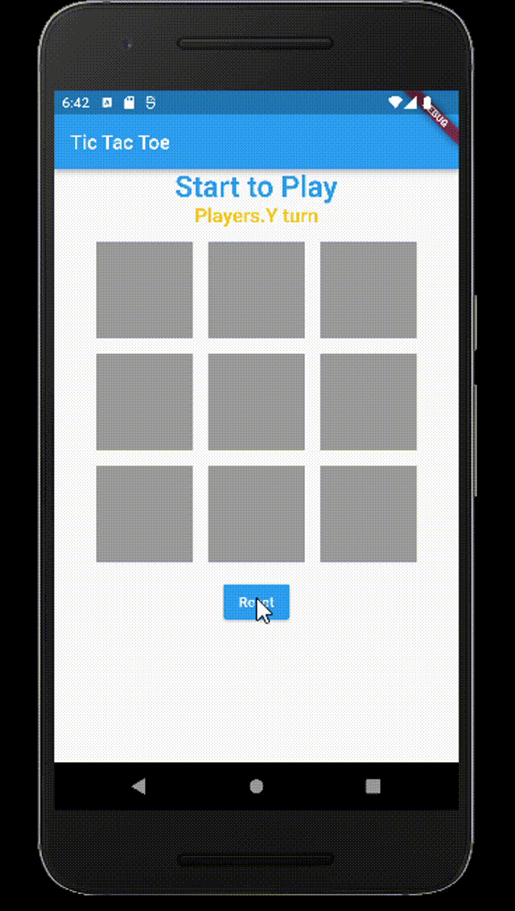

<h1>Sanal Magaza Projesi</h1>

This app created to understand Flutter. It is a basic app that made me to understand enum, OOP, dart and the class structure. On next project I will try more comlicated structures.

<h2>Screen Emulator</h2>

For screen emulator Nexus_6P API 31 was used. On next projects Apple devices will be used as well.

<h2>Screan Gif</h2>

